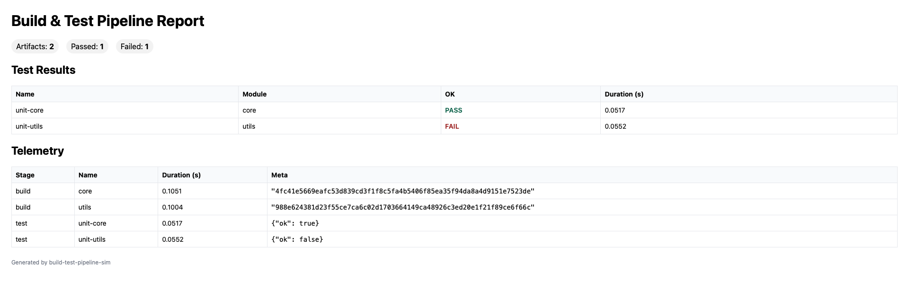

# Build & Test Pipeline Simulator

[](https://github.com/jdawood1/build-test-pipeline-sim/actions/workflows/ci.yml)
[](LICENSE)

Config-driven build & test pipeline simulator.
Takes a YAML config of modules + tests, simulates builds and test runs with structured telemetry, and writes artifacts + reports.
Useful as a lightweight demo of CI/CD pipelines.

---

## Run in 30 seconds

```bash
python -m venv .venv && source .venv/bin/activate
python -m pip install -U pip

# install runtime deps
python -m pip install -r requirements.txt

# (optional) for dev tooling + parquet export
python -m pip install -r requirements-dev.txt

# run pipeline
sim run --config sample/pipeline.yml --out build/

# validate config / print plan with digests
sim validate --config sample/pipeline.yml
sim explain --config sample/pipeline.yml --digests
```

**Outputs:**
- `build/telemetry.csv` — CSV log of build/test stages
- `build/events.ndjson` — one JSON object per line (telemetry)
- `build/results.json` — artifacts + test results summary
- `build/telemetry.parquet` — Parquet (if `pandas` + `pyarrow` installed)
- `build/results.parquet` — Parquet (if `pandas` + `pyarrow` installed)
- `build/report.html` — static HTML report with test results + telemetry

Sample HTML report:



---

## Requirements
- Python 3.11+
- See `requirements.txt` for runtime deps:
  - click, pyyaml
- For Parquet exports + dev tooling:
  - `requirements-dev.txt` adds pytest, ruff, black, mypy, pandas, pyarrow

---

## CLI

```bash
# run (with optional --dry, which only writes empty outputs + OK status)
sim run --config sample/pipeline.yml --out build/
sim run --config sample/pipeline.yml --out build/ --dry

# validate / explain
sim validate --config sample/pipeline.yml
sim explain --config sample/pipeline.yml --digests
```

---

## Pre-commit Hooks

To keep formatting and linting consistent, add `.pre-commit-config.yaml`:

```yaml
repos:
  - repo: https://github.com/psf/black
    rev: 24.8.0
    hooks:
      - id: black
  - repo: https://github.com/astral-sh/ruff-pre-commit
    rev: v0.5.7
    hooks:
      - id: ruff
        args: [--fix]
  - repo: https://github.com/pre-commit/pre-commit-hooks
    rev: v4.6.0
    hooks:
      - id: end-of-file-fixer
      - id: trailing-whitespace
      - id: check-yaml
      - id: check-toml
```

Install once:
```bash
pip install pre-commit
pre-commit install
pre-commit run --all-files
```

---

## Roadmap
- [x] Export additional formats (NDJSON, Parquet)
- [ ] Richer validation errors (duplicate modules, bad digests)
- [ ] Multiple pipelines per config
- [ ] Latency simulation toggle
- [ ] Small JS sorting for HTML tables

---

## License
MIT © 2025 John Dawood
